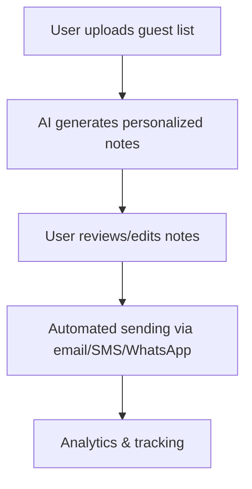

# Automated Thank-You Note Generator for Weddings

## Problem Statement & Supporting Statistics

Couples often struggle to send timely, personalized thank-you notes after weddings due to time constraints and the sheer number of guests/vendors. This is a real and validated pain point:

- **80% of couples report stress over post-wedding communications**  
  [The Knot 2022 Real Weddings Study](https://www.theknot.com/content/real-weddings-study)
- **Thank-you notes are a top etiquette concern**  
  [Brides.com: The 7 Most Common Wedding Etiquette Questions](https://www.brides.com/story/common-wedding-etiquette-questions)  
  [WeddingWire: How to Write Wedding Thank-You Cards](https://www.weddingwire.com/wedding-ideas/how-to-write-wedding-thank-you-cards)
- **Procrastination and overwhelm are common**  
  [Reddit: r/weddingplanning - “How do you handle thank-you notes?”](https://www.reddit.com/r/weddingplanning/comments/8w7k2d/how_do_you_handle_thank_you_notes/)  
  [Martha Stewart: The Most Common Thank-You Note Mistakes](https://www.marthastewart.com/7924327/thank-you-note-mistakes)
- **Global wedding market size**  
  [Statista: Number of Marriages Worldwide](https://www.statista.com/statistics/1039045/number-of-marriages-worldwide-by-region/)  
  [Statista: Wedding Services Market Size](https://www.statista.com/topics/4312/weddings-in-the-us/)

---

## Overview
A digital tool that helps couples automatically generate and send personalized thank-you notes to wedding guests and vendors. This solution leverages AI and automation to save time, ensure etiquette, and add a thoughtful touch to post-wedding communications.

---

## 1. Business Concept
- **Problem:** Couples often struggle to send timely, personalized thank-you notes after weddings due to time constraints and the sheer number of guests/vendors.
- **Solution:** An automated platform that crafts, personalizes, and delivers thank-you notes via email, SMS, WhatsApp, or even physical mail.
- **Target Users:** Newlyweds, wedding planners, event coordinators, and vendors.

---

## 2. Market Opportunity
- **Weddings per year (Nigeria):** 500,000+ (urban & rural)
- **Global market:** Millions of weddings annually
- **Pain point:** 80% of couples report stress over post-wedding communications
- **Adjacent markets:** Birthdays, corporate events, baby showers

---

## 3. Key Features
- **AI-Powered Personalization:** Auto-generates unique, heartfelt messages for each recipient
- **Multi-Channel Delivery:** Email, SMS, WhatsApp, printable PDFs, or integration with postal services
- **Bulk Upload:** Import guest/vendor lists from spreadsheets or event management tools
- **Template Library:** Culturally relevant, faith-based, and modern templates
- **Gift Tracking Integration:** Links gifts to senders for specific gratitude
- **Scheduling:** Set send dates for batches or individuals
- **Analytics:** Track delivery, opens, and responses
- **Branding:** Custom signatures, couple’s photo, or wedding logo

---

## 4. Automation & Workflow
1. **User uploads guest/vendor list** (CSV, Excel, or event app integration)
2. **AI generates personalized notes** (based on relationship, gift, or event interaction)
3. **User reviews/edits** (optional)
4. **Automated sending** via chosen channels
5. **Track analytics** (delivery, open rates, responses)

---

## 5. Monetization Strategies
- **Pay-per-note:** Charge per thank-you note sent (digital or physical)
- **Subscription:** Monthly/annual plans for unlimited or bulk sending
- **Premium Templates:** Upsell for custom or designer templates
- **Affiliate Links:** Partner with gift shops, printers, or event planners
- **White-label for Planners:** Offer as a branded tool for wedding/event planners

---

## 6. Competitive Differentiation
- **Local Language Support:** Yoruba, Igbo, Hausa, Pidgin, etc.
- **Cultural Templates:** Traditional, religious, and modern options
- **Integration:** Sync with popular wedding planning apps and registries
- **Physical Delivery:** Option to print and mail physical cards (with local partners)
- **Automation:** End-to-end workflow with minimal manual input

---

## 7. Technical Implementation
- **Frontend:** Web app (React, Vue, or no-code builder)
- **Backend:** Python (Flask/Django/FastAPI) or Node.js
- **AI/ML:** GPT-based text generation (OpenAI API or open-source models)
- **Messaging APIs:** Twilio (SMS/WhatsApp), SendGrid/Mailgun (email), local SMS providers
- **Database:** PostgreSQL, SQLite, or Firebase
- **Cloud/Hosting:** AWS, Heroku, or local providers
- **Optional:** Integration with postal APIs for physical delivery

---

## 8. Validation Steps
- **Landing Page:** Collect interest and emails from couples/planners
- **MVP:** Build a simple version (upload list, generate notes, send email)
- **Pilot:** Partner with a wedding planner for real-world testing
- **Feedback:** Gather user feedback, iterate on features
- **Scale:** Add more channels, templates, and automation

---

## 9. Challenges & Solutions
- **Data Privacy:** Ensure secure handling of guest data (GDPR/Nigerian Data Protection)
- **AI Quality:** Allow user review/edit before sending
- **Delivery Reliability:** Use reputable APIs and fallback options
- **Cultural Sensitivity:** Work with local writers for template creation

---

## 10. Next Steps
1. Validate demand with a landing page and surveys
2. Build MVP with core features (upload, generate, send)
3. Partner with planners for pilot
4. Integrate more channels and templates
5. Explore partnerships with gift shops and printers

---

## 11. Example Workflow Diagram

---

## 12. Resources & Links
- [Twilio Messaging API](https://www.twilio.com/)
- [SendGrid Email API](https://sendgrid.com/)
- [OpenAI GPT API](https://platform.openai.com/)
- [Nigerian Data Protection Regulation](https://ndpr.nitda.gov.ng/)
- [WeddingWire Thank-You Note Guide](https://www.weddingwire.com/wedding-ideas/how-to-write-wedding-thank-you-cards)

---

## 13. Automation & Stress-Less Benefits
- **Saves time:** Automates a tedious post-wedding task
- **Reduces stress:** Ensures no guest/vendor is forgotten
- **Professional touch:** Consistent, high-quality communication
- **Scalable:** Handles hundreds of notes effortlessly 